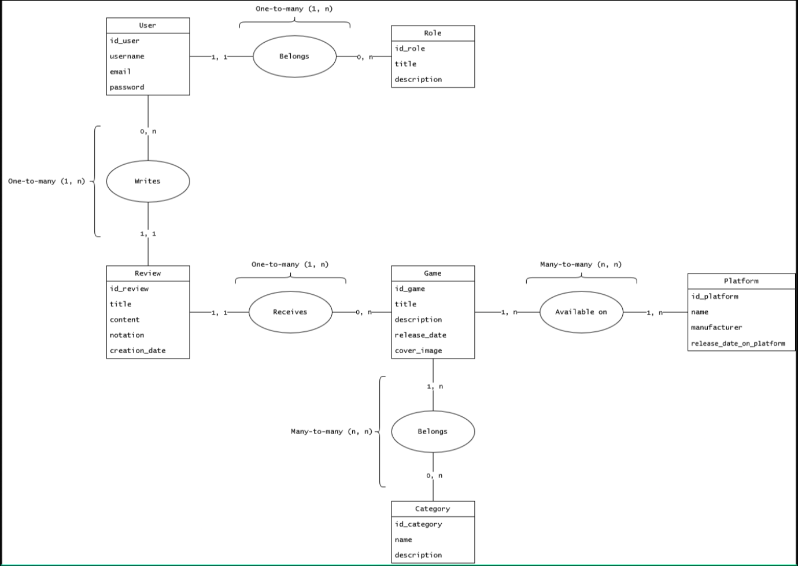
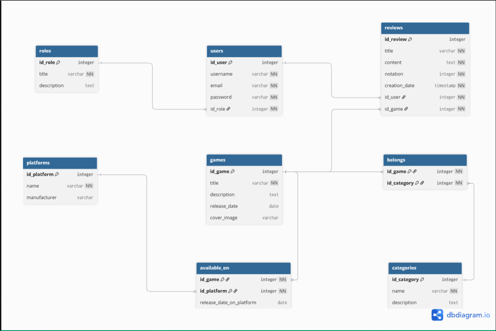

# MariaDB Documentation

## 1. Conceptual Data Model (CDM)

The CDM defines business entities and their semantic interactions, without any technical constraints related to the database engine.

> [!NOTE] 
> **Asymmetric Logic of Cardinalities**
> 
> Dependency analysis has helped secure the application logic:
> - **One-to-Many (1:N)**: A review concerns one and only one game (1,1), but a game can receive from zero to many reviews (0,n). This guarantees the isolation of ratings (a single review cannot simultaneously modify the overall rating of multiple games).
> - **Many-to-Many (N:M)**: A game can be available on several platforms (1,n) and a platform hosts several games (1,n). This complex cardinality requires specific resolution when transitioning to the logical model.

---

## 2. Logical Data Model (LDM)

The LDM is the technical translation of the CDM. It paves the way for the DDL (Data Definition Language) script by introducing the concepts of primary keys (PK), foreign keys (FK), and data types.

> [!IMPORTANT] 
> **Resolution of Complex Relationships**
> 
> The Many-to-Many relationships from the CDM (*Available on* and *Belongs*) have been canonically transformed into junction tables in the LDM (`available_on` and `belongs`).
> 
> **Integrity constraint**: These junction tables use a composite primary key (the strict union of `id_game` and `id_platform` / `id_category`). This prevents any logical attack or API error attempting to link the same category to the same game multiple times.

> [!NOTE] Official References
> - [DBML (Database Markup Language) Documentation](https://dbml.org/docs/)
> - [MariaDB: InnoDB Foreign Key Constraints](https://mariadb.com/kb/en/innodb-foreign-key-constraints/)